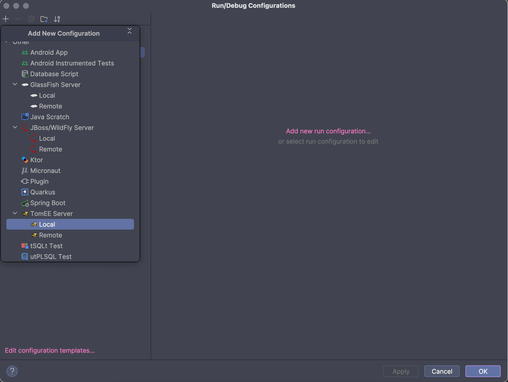
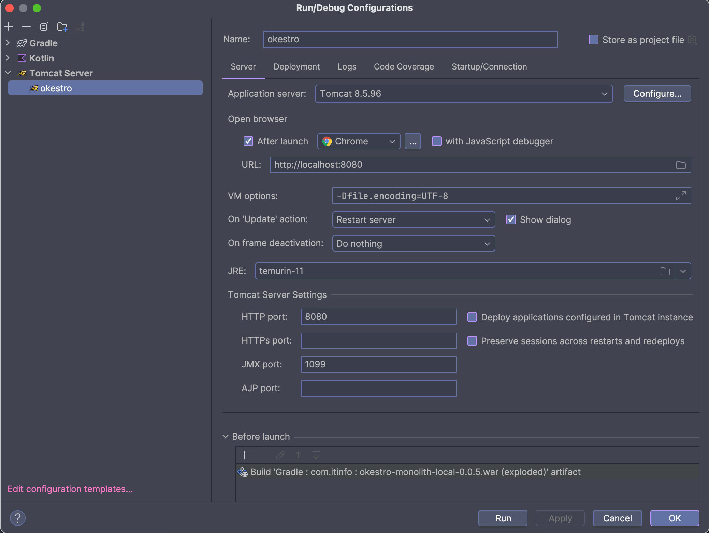
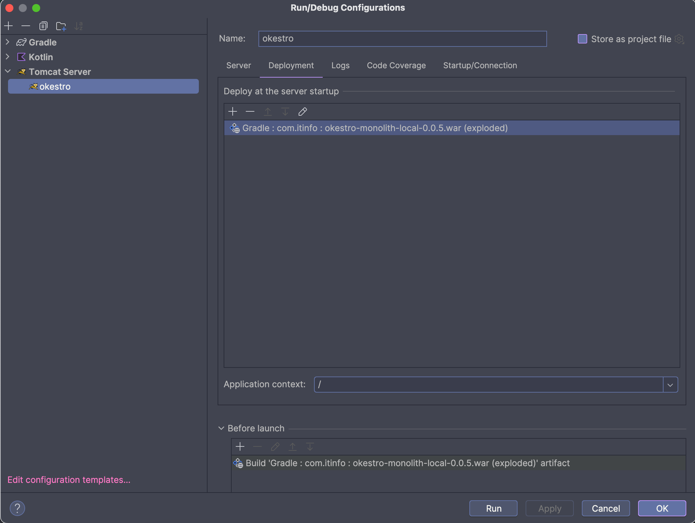
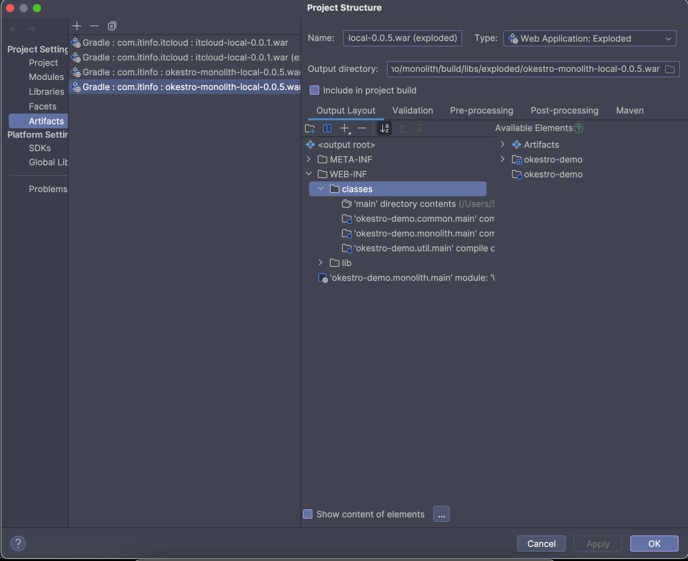

# okestro-demo


오케스트로 (복구 중)

---

## What's included?

![shield-java][shield-java]
![shield-spring][shield-spring]
![shield-spring-security][shield-spring-security]
![shield-swagger][shield-swagger]
![shield-kotlin][shield-kotlin]
![shield-gradle][shield-gradle]
![shield-tomcat][shield-tomcat]

---

## 🚀Quickstart

### 🧰Prerequisite(s)

- 🛠Intellij IDEA 
- ☕JDK (OpenJDK 1.8_201)
- 🍃Spring (`4.3.14.RELEASE`)
- 🐘Gradle (`7.4.2`)
- 😺Apache Tomcat (`8.5.38`)
- 🛅H2 Database
- Grafana (_Optional_)
- 🐳Docker
  - `tomcat:8.5.38-jre8-alpine` (ssl port: `8443`)
  - `postgres:10.12-alpine` (jdbc port: `5432`)
  - ...

---

## 🐘Gradle

Run this script to create artifact

```sh
./gradlew monolith:war -Pprofile=staging
# 프로퍼티 `profile` 유형
# - local: 로컬 (개발환경)
# - staging
```

---

## 😺Tomcat 

> Intellij IDEA Community Edition을 사용할 경우 [Smart Tomcat 플러그인](https://github.com/zengkid/SmartTomcat) 을 활용하여 구성 

- 톰켓 환경 구성: 📁`<catalina base path>`
  - SSL 포트: `8443`
  - p12 파일 구성: 📁`<catalina base path>/keystore/okestro.p12`) 비밀번호: `okestro2018`
  - context path: `/`
  - 📁`<catalina base path>/conf/server.xml` 수정

### Intellij Ultimate에서 설정

| no. | step | image |
| :---: | :--- | :---: |
| 1 | 톰캣 설정 생성 |  |
| 2 | 톰캣 설정 구성 |  |
| 3 | 배포 대상 아티팩트 설정 | <br/>context path 를 꼭 `/`으로 설정 |
| 4 | 배포 아티팩트 구성 | <br/><ul><li>`/WEB-INF/classes`밑에 두개 모듈(`common`, `util`) 추가</li><li>Output Directory 수정 필요할 경우 진행 (Optional)</li></ul> |

> [이슈 #1][issue1] 확인 내용
> 
> macOS에서 진행 했을 때 📁`monolith/build/libs/exploded/okestro-*.war/`경로가 생김
> Windows에서는 📁`monolith/build/libs/exploded/` 까지만 생기고 `okestro-*.war` 파일이 생김

### 📁`conf/server.xml`
     
```xml
<?xml version="1.0" encoding="UTF-8"?>
<Server port="8015" shutdown="SHUTDOWN">
  <Service name="Catalina">
    <Connector port="8080" protocol="HTTP/1.1"
               connectionTimeout="20000"
               redirectPort="8443"
               maxParameterCount="1000"
    />
   
    <!-- ... 생략 ...   -->
    <Connector port="8443" protocol="HTTP/1.1"
               maxThreads="150" SSLEnabled="true" scheme="https" secure="true"
               clientAuth="false" sslProtocol="TLS"
               keystoreFile="<catalina base path>/keystore/okestro.p12" keystorePass="okestro2018" />
  </Service>
</Server>
```

---

## 🛅H2 

| title | description |
| :---: | :--- |
| 목적 | 오케스트로 핵심정보 관리 |
| 🔌jdbc (로컬) | `jdbc:h2:<프로젝트경로>\docker\okestro\symphony?CIPER=AES` |
| 🔌jdbc (운영) | `jdbc:h2:~\.symphony\symphony?CIPER=AES` |
| 🔑id / pw | `symphony` / `symphony!123 symphony!123` |
  
[🧾자세한 정보 ... ][toH2]

---

## 🐳Docker 

### 🛠Okestro 

⚠ war 빌드 후 진행!
- `docker/okestro` 밑 📁`ROOT`폴더가 생기도록

#### On Linux

```sh
docker build -t okestro/cst_tomcat:0.0.5 \
  ./
```

#### On Windows

```batch
docker build -t okestro/cst_tomcat:0.0.5 ^
  \.
```

### ▶️Run

#### On Linux

```sh
# okestro
docker run -d -it \
  --name cst_tomcat2 \
  -p 8080:8080 \
  -p 8443:8443 \
  okestro/cst_tomcat:0.0.5

# postgres
docker run -d -it \
  --name cst_postgres \
  -e POSTGRES_PASSWORD=mysecretpassword \
  -e PGDATA=/var/lib/postgresql/data/pgdata \
  -v where/to/mount:/var/lib/postgresql/data \
  postgres:10.12-alpine
```

#### On Windows

```batch
REM okestro
docker run -d -it ^
  --name okestro/cst_tomcat ^
  -p 8080:8080 ^
  -p 8443:8443 ^
  okestro/cst_tomcat:0.0.5

REM postgres
docker run -d -it ^
  --name cst_postgres ^
  -e POSTGRES_PASSWORD=mysecretpassword ^
  -e PGDATA=/var/lib/postgresql/data/pgdata ^
  -v where/to/mount:/var/lib/postgresql/data ^
  postgres:10.12-alpine
```

## 🎯TODO

- [ ] 소스코드 초기상태 복구
  - [x] 버전 및 의존라이브러리 목록 정리
  - [x] model 및 상수
  - [x] tomcat embedded 구성
  - [ ] docker 관련 정보 수집
  - [ ] model 안정화
- [ ] package별 endpoint구현
- [ ] docker 생성 자동화 스크립트 (환경변수 지정 > ovirt ip주소)
- [x] swagger 구성
- [ ] dokka 구성


## Dependencies 주입

| isChecked | full artifact name (w version) |
| :---: | :--- |
| 🔆 qemu의존 | `org.codehaus.mojo:animal-sniffer-annotations:1.14` |
| 🔆 qemu의존 | `com.google.code.findbugs:annotations:2.0.3` |
| 🔆 spring의존 | `aopalliance:aopalliance:1.0` |
| ✅ | `org.aspectj:aspectjrt:1.6.10` |
| ✅ | `org.aspectj:aspectjweaver:1.8.0` |
| 🔆 qemu의존 | `com.google.auto:auto-common:0.3` |
| 🔆 qemu의존 | `com.google.auto.service:auto-service:1.0-rc2` |
| ✅ | `org.webjars:bootstrap:3.3.6` |
| ✅ | `cglib:cglib-nodep:3.1` |
| 🔆 tiles의존 | `commons-beanutils:commons-beanutils:1.8.0` |
| 🔆 spring의존 | `commons-codec:commons-codec:1.9` |
| ✅ | `commons-configuration:commons-configuration:1.9` |
| ✅ | `commons-dbcp:commons-dbcp:1.4` |
| 🔆 tiles의존 | `commons-digester:commons-digester:2.0` |
| ✅ | `commons-fileupload:commons-fileupload:1.4` |
| 🔆 commons-io의존 | `commons-io:commons-io:2.7` |
| 🔆 commons-configuration의존 | `commons-lang:commons-lang:2.6` |
| ✅ | `org.apache.commons:commons-lang3:3.3.4` |
| 🔆 spring의존 | `commons-logging:commons-logging:1.1.1` |
| 🔆 commons-dbcp의존 | `commons-pool:commons-pool:1.6` |
| ✅ | `com.google.code.gson:gson:2.8.0` |
| 🔆 qemu의존 | `com.google.guava:guava:r05` |
| ✅ | `com.h2database:h2:1.4.197` |
| 🔆 spring의존 | `org.apache.httpcomponents:httpclient:4.5` |
| 🔆 spring의존 | `org.apache.httpcomponents:httpcore:4.4.1` | 
| 🔆 qemu의존 | `com.fasterxml.jackson.core:jackson-annotations:2.5.0` |
| 🔆 qemu의존 | `com.fasterxml.jackson.core:jackson-core:2.5.0` |
| 🔆 spring의존 | `org.codehaus.jackson:jackson-core-asl:1.9.13` |
| 🔆 qemu의존 | `com.fasterxml.jackson.core:jackson-databind:2.5.0` |
| 🔆 spring의존 | `org.codehaus.jackson:jackson-mapper-asl:1.9.13` |
| ✅ | `org.jasypt:jasypt:1.9.2` | 
| ✅ | `org.jasypt:jasypt-spring3:1.9.2` |
| ✅ | `javax.inject:javax.inject:1` |
| 🔆 tiles의존 | `org.slf4j:jcl-over-slf4j:1.7.6` |
| ✅ | `org.webjars:jquery:2.1.4` |
| 🔆 qemu의존 | `com.jcraft:jsch:0.1.52` |
| ✅ | `com.googlecode.json-simple:json-simple:1.1.1` |
| ✅ | `javax.servlet:jstl:1.2` |
| ✅ | `log4j:log4j:1.2.17` |
| ✅ | `org.apache.logging.log4j:log4j-api:2.17.0` |
| ✅ | `org.apache.logging.log4j:log4j-core:2.17.0` |
| ✅ | `org.apache.logging.log4j:log4j-slf4j-impl:2.17.0` |
| ✅ | `org.mybatis:mybatis:3.2.8` |
| ✅ | `org.mybatis:mybatis-spring:1.2.2` |
| ✅ | `org.postgresql:postgresql:42.1.4` |
| ✅ | `org.anarres.qemu:qemu-examples:1.0.6` |
| ✅ | `org.anarres.qemu:qemu-exec:1.0.6` |
| ✅ | `org.anarres.qemu:qemu-image:1.0.6` |
| ✅ | `org.anarres.qemu:qemu-qapi:1.0.6` |
| 🔆 spring의존 | `relaxngDatatype:relaxngDatatype:20020414` |
| ✅ | `org.ovirt.engine.api:sdk:4.2.1` |
| 🔆 spring의존 | `org.slf4j:slf4j-api:1.7.7` |
| ✅ | `org.springframework:spring-aop:4.3.14.RELEASE` |
| ✅ | `org.springframework:spring-beans:4.3.14.RELEASE` |
| ✅ | `org.springframework:spring-context:4.3.14.RELEASE` |
| ✅ | `org.springframework:spring-core:4.3.14.RELEASE` |
| ✅ | `org.springframework:spring-expression:4.3.14.RELEASE` |
| ✅ | `org.springframework:spring-jdbc:4.3.14.RELEASE` |
| ✅ | `org.springframework:spring-messaging:4.3.14.RELEASE` |
| ✅ | `org.springframework.security:spring-security-acl:4.2.2.RELEASE` |
| ✅ | `org.springframework.security:spring-security-config:4.2.2.RELEASE` |
| ✅ | `org.springframework.security:spring-security-core:4.2.2.RELEASE` |
| ✅ | `org.springframework.security:spring-security-taglibs:4.2.2.RELEASE` |
| ✅ | `org.springframework.security:spring-security-web:4.2.2.RELEASE` |
| ✅ | `org.springframework:spring-test:4.3.14.RELEASE` |
| ✅ | `org.springframework:spring-tx:4.3.14.RELEASE` |
| ✅ | `org.springframework:spring-web:4.3.14.RELEASE` |
| ✅ | `org.springframework:spring-webmvc:4.3.14.RELEASE` |
| ✅ | `org.springframework:spring-websocket:4.3.14.RELEASE` |
| 🔆 spring의존 | `javax.xml.stream:stax-api:1.0-2` |
| ✅ | `org.apache.tiles:tiles-api:3.0.5` |
| 🔆 tiles의존 | `org.apache.tiles:tiles-autotag-core-runtime:1.1.0` |
| ✅ | `org.apache.tiles:tiles-core:3.0.5` |
| ✅ | `org.apache.tiles:tiles-jsp:3.0.5` |
| 🔆 tiles의존 | `org.apache.tiles:tiles-request-api:1.0.6` |
| 🔆 tiles의존 | `org.apache.tiles:tiles-request-jsp:1.0.6` |
| 🔆 tiles의존 | `org.apache.tiles:tiles-request-servlet:1.0.6` |
| ✅ | `org.apache.tiles:tiles-servlet:3.0.5` |
| ✅ | `org.apache.tiles:tiles-template:3.0.5` |
| 🔆 spring의존 | `com.sun.xml.txw2:txw2:20110809` |


[toH2]: docs/H2.md
[toENDPOINTS]: docs/ENDPOINTS.md
[toPOSTGRES]: docs/POSTGRES.md


[shield-java]: https://img.shields.io/badge/Temurin-11-f3812a?logo=openjdk&logoColor=f3812a&style=flat-square
[shield-spring]: https://img.shields.io/badge/Spring-4.3.14.RELEASE-6DB33F?logo=spring&logoColor=6DB33F&style=flat-square
[shield-spring-security]: https://img.shields.io/badge/Spring%20Security-4.2.2.RELEASE-6DB33F?logo=springsecurity&logoColor=6DB33F&style=flat-square
[shield-swagger]: https://img.shields.io/badge/Swagger-2.9.2-85EA2D?logo=swagger&logoColor=85EA2D&style=flat-square 
[shield-kotlin]: https://img.shields.io/badge/Kotlin-1.4.31-0095D5?logo=kotlin&logoColor=0095D5&style=flat-square
[shield-gradle]: https://img.shields.io/badge/Gradle-7.4.2-abd759?logo=gradle&logoColor=abd759&style=flat-square
[shield-tomcat]: https://img.shields.io/badge/Tomcat-8.5.38-F8DC75?logo=apachetomcat&logoColor=F8DC75&style=flat-square

[issue1]: https://github.com/ITJEONGBO/okestro-demo/issues/1