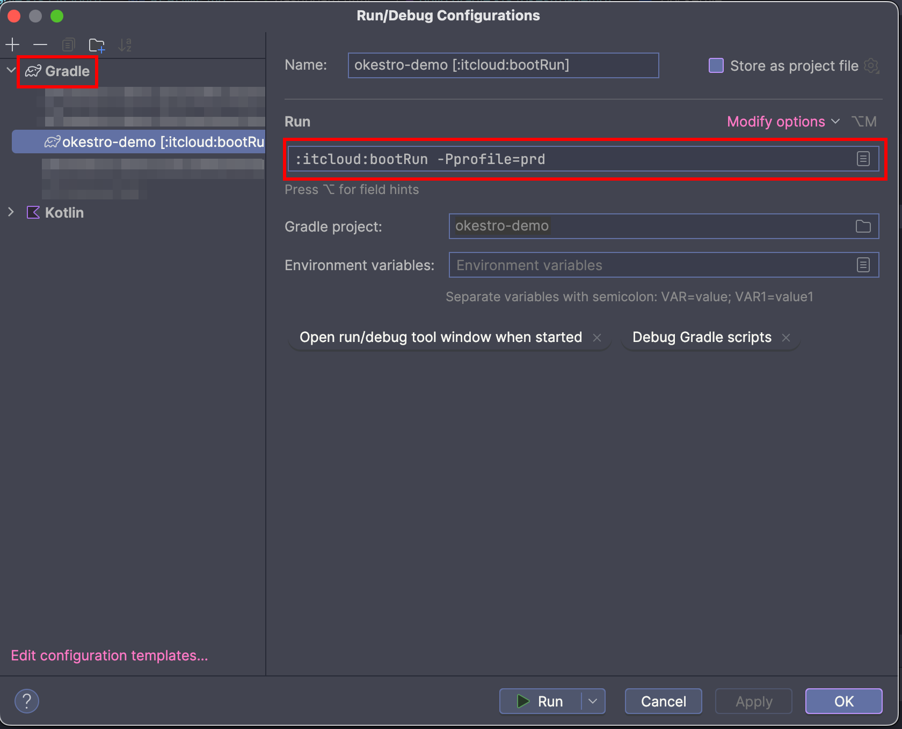

# okestro-demo


오케스트로 (복구 중)

---

## What's included?

![shield-java][shield-java]
![shield-spring][shield-spring]
![shield-spring-security][shield-spring-security]
![Node.js (`11.0.23`)][shield-nodejs]
![React.js (`18.3.x`)][shield-reactjs]
![shield-swagger][shield-swagger]
![shield-kotlin][shield-kotlin]
![shield-gradle][shield-gradle]
![shield-tomcat][shield-tomcat]

---

## 🚀Quickstart

### 🧰Prerequisite(s)

- 🛠Intellij IDEA 
- ☕JDK (OpenJDK 1.8_201)
- 🍃Spring (`5.3.20`) / Boot (`2.7.0`)
- 🐘Gradle (`7.4.2`)
- 🧶Node.js (`11.0.23`)
- ⚛️React.js (`18.3.x`)
- 😺Apache Tomcat (`9.0.63`)
- 🐳Docker
  - `tomcat:8.5.38-jre8-alpine` (ssl port: `8443`)
  - `postgres:10.12-alpine` (jdbc port: `5432`)
  - `gradle:7.4.2-jdk11-focal`
  - `eclipse-temurin:11-jdk-focal`
- Grafana (ovirt안에 내장)

---

## 🧶Node.js

```sh
# React 앱 실행
npm start
# React 앱 빌드
npm build
```

> npm이 없을 경우 설치 권고

## 🐘Gradle

```sh
#
# 프로퍼티 `profile` 유형
# - local: 로컬 (개발환경)
# - staging
#

# 스프링부트 프로젝트 실행 (개발)
./gradlew itcloud:bootRun -Pprofile=staging

# 아티팩트 생성 (운영)
./gradlew itcloud:bootJar -Pprofile=staging
```



> 실행 후 http://localhost:8080 을 브라우저로 열기

---

## 😺Tomcat 

- 톰켓 환경 구성: 📁`<catalina base path>`
  - SSL 포트: `8443`
  - p12 파일 구성: 📁`<catalina base path>/keystore/okestro.p12`) 비밀번호: `okestro2018`
  - context path: `/`
  - 📁`<catalina base path>/conf/server.xml` 수정

### 📁`conf/server.xml`
     
```xml
<?xml version="1.0" encoding="UTF-8"?>
<Server port="8015" shutdown="SHUTDOWN">
  <Service name="Catalina">
    <Connector port="8080" protocol="HTTP/1.1"
               connectionTimeout="20000"
               redirectPort="8443"
               maxParameterCount="1000"
    />
   
    <!-- ... 생략 ...   -->
    <Connector port="8443" protocol="HTTP/1.1"
               maxThreads="150" SSLEnabled="true" scheme="https" secure="true"
               clientAuth="false" sslProtocol="TLS"
               keystoreFile="<catalina base path>/keystore/okestro.p12" keystorePass="okestro2018" />
  </Service>
</Server>
```

---

## 🐳Docker 

### 🛠Build

```sh
# Running on macOS M1
docker build -t itinfo/itcloud:0.0.1 .

# Okestro
docker build -t itinfo/okestro:0.0.5 .
```

### ▶️Run

#### On Linux

```sh
# itcloud
docker run -d -it --name itcloud \
-e ITCLOUD_PORT_HTTP=8080 \
-e ITCLOUD_PORT_HTTPS=8443 \
-e ITCLOUD_OVIRT_IP=192.168.0.80 \
-e POSTGRES_JDBC_URL=192.168.0.80 \
-e POSTGRES_DATASOURCE_JDBC_ID=okestro \
-e POSTGRES_DATASOURCE_JDBC_PW=okestro2018 \
-p 8080:8080 -p 8443:8443 itinfo/itcloud:0.0.1

# postgres
docker run -d -it \
  --name cst_postgres \
  -e POSTGRES_PASSWORD=mysecretpassword \
  -e PGDATA=/var/lib/postgresql/data/pgdata \
  -v where/to/mount:/var/lib/postgresql/data \
  postgres:10.12-alpine
```

#### On Windows

```batch
REM okestro
docker run -d -it ^
  --name okestro/cst_tomcat ^
  -p 8080:8080 ^
  -p 8443:8443 ^
  okestro/cst_tomcat:0.0.5

REM postgres
docker run -d -it ^
  --name cst_postgres ^
  -e POSTGRES_PASSWORD=mysecretpassword ^
  -e PGDATA=/var/lib/pgsql/data ^
  -v where/to/mount:/var/lib/pgsql/data ^
  postgres:12.12-alpine
```

### (사용자 정보 접근을 위한) PostgresDB 초기 구성

> Postgres 관리자 권한으로 로그인

```sh
su - postgres # postgres 사용자로 su 로그인
psql -U postgres -d engine # postgres 사용자로 engine 테이블스페이스에 로그인 (비밀번호X)
```

```sql
GRANT ALL ON SCHEMA aaa_jdbc TO okestro;
#
# GRANT
```

### 유용한 쿼리

```sql
# DESCRIBE 테이블
SELECT 
   table_name, column_name, data_type 
FROM 
   information_schema.columns
WHERE 1=1
AND table_schema = 'aaa_jdbc'
AND table_name = 'users';
```

```sh
cd /etc/pki/ovirt-engine/certs
```

---


## 🎯TODO

- [ ] 소스코드 초기상태 복구
  - [x] 버전 및 의존라이브러리 목록 정리
  - [x] model 및 상수
  - [x] tomcat embedded 구성
  - [x] docker 관련 정보 수집
  - [ ] model 안정화
- [ ] package별 endpoint구현
- [x] docker 생성 자동화 스크립트 (환경변수 지정 > ovirt ip주소)
- [x] swagger 구성 (`/swagger-ui/`)
- [x] dokka 구성

---

## Spring Boot 구성 

https://github.com/Gaia3D/mago3d 참고

---

## Swagger 3 

- 접속URL: `/swagger-ui/`

---

## Dependencies 주입

| isChecked | full artifact name (w version) |
| :---: | :--- |
| ✅ | `org.aspectj:aspectjrt:1.6.10` |
| ✅ | `org.aspectj:aspectjweaver:1.8.0` |
| ✅ | `org.webjars:bootstrap:3.3.6` |
| ✅ | `cglib:cglib-nodep:3.1` |
| ✅ | `commons-configuration:commons-configuration:1.9` |
| ✅ | `commons-dbcp:commons-dbcp:1.4` |
| ✅ | `commons-fileupload:commons-fileupload:1.4` |
| ✅ | `org.apache.commons:commons-lang3:3.3.4` |
| ✅ | `com.google.code.gson:gson:2.8.0` |
| ✅ | `com.h2database:h2:1.4.197` |
| ✅ | `org.jasypt:jasypt:1.9.2` | 
| ✅ | `org.jasypt:jasypt-spring3:1.9.2` |
| ✅ | `javax.inject:javax.inject:1` |
| ✅ | `org.webjars:jquery:2.1.4` |
| ✅ | `com.googlecode.json-simple:json-simple:1.1.1` |
| ✅ | `javax.servlet:jstl:1.2` |
| ✅ | `log4j:log4j:1.2.17` |
| ✅ | `org.apache.logging.log4j:log4j-api:2.17.0` |
| ✅ | `org.apache.logging.log4j:log4j-core:2.17.0` |
| ✅ | `org.apache.logging.log4j:log4j-slf4j-impl:2.17.0` |
| ✅ | `org.mybatis:mybatis:3.2.8` |
| ✅ | `org.mybatis:mybatis-spring:1.2.2` |
| ✅ | `org.postgresql:postgresql:42.1.4` |
| ✅ | `org.anarres.qemu:qemu-examples:1.0.6` |
| ✅ | `org.anarres.qemu:qemu-exec:1.0.6` |
| ✅ | `org.anarres.qemu:qemu-image:1.0.6` |
| ✅ | `org.anarres.qemu:qemu-qapi:1.0.6` |
| ✅ | `org.ovirt.engine.api:sdk:4.2.1` |
| ✅ | `org.springframework:spring-aop:4.3.14.RELEASE` |
| ✅ | `org.springframework:spring-beans:4.3.14.RELEASE` |
| ✅ | `org.springframework:spring-context:4.3.14.RELEASE` |
| ✅ | `org.springframework:spring-core:4.3.14.RELEASE` |
| ✅ | `org.springframework:spring-expression:4.3.14.RELEASE` |
| ✅ | `org.springframework:spring-jdbc:4.3.14.RELEASE` |
| ✅ | `org.springframework:spring-messaging:4.3.14.RELEASE` |
| ✅ | `org.springframework.security:spring-security-acl:4.2.2.RELEASE` |
| ✅ | `org.springframework.security:spring-security-config:4.2.2.RELEASE` |
| ✅ | `org.springframework.security:spring-security-core:4.2.2.RELEASE` |
| ✅ | `org.springframework.security:spring-security-taglibs:4.2.2.RELEASE` |
| ✅ | `org.springframework.security:spring-security-web:4.2.2.RELEASE` |
| ✅ | `org.springframework:spring-test:4.3.14.RELEASE` |
| ✅ | `org.springframework:spring-tx:4.3.14.RELEASE` |
| ✅ | `org.springframework:spring-web:4.3.14.RELEASE` |
| ✅ | `org.springframework:spring-webmvc:4.3.14.RELEASE` |
| ✅ | `org.springframework:spring-websocket:4.3.14.RELEASE` |
| ✅ | `org.apache.tiles:tiles-api:3.0.5` |
| ✅ | `org.apache.tiles:tiles-core:3.0.5` |
| ✅ | `org.apache.tiles:tiles-jsp:3.0.5` |
| ✅ | `org.apache.tiles:tiles-servlet:3.0.5` |
| ✅ | `org.apache.tiles:tiles-template:3.0.5` |


[toENDPOINTS]: docs/ENDPOINTS.md
[toPOSTGRES]: docs/POSTGRES.md

[shield-java]: https://img.shields.io/badge/Temurin-11-f3812a?logo=openjdk&logoColor=f3812a&style=flat-square
[shield-spring]: https://img.shields.io/badge/Spring-4.3.14.RELEASE-6DB33F?logo=spring&logoColor=6DB33F&style=flat-square
[shield-spring-security]: https://img.shields.io/badge/Spring%20Security-4.2.2.RELEASE-6DB33F?logo=springsecurity&logoColor=6DB33F&style=flat-square
[shield-nodejs]: https://img.shields.io/badge/Node.js-11.0.23-5FA04E?logo=nodedotjs&logoColor=5FA04E&style=flat-square
[shield-reactjs]: https://img.shields.io/badge/React.js-18.3.x-61DAFB?logo=react&logoColor=61DAFB&style=flat-square
[shield-swagger]: https://img.shields.io/badge/Swagger-2.9.2-85EA2D?logo=swagger&logoColor=85EA2D&style=flat-square 
[shield-kotlin]: https://img.shields.io/badge/Kotlin-1.5.31-0095D5?logo=kotlin&logoColor=0095D5&style=flat-square
[shield-gradle]: https://img.shields.io/badge/Gradle-7.4.2-abd759?logo=gradle&logoColor=abd759&style=flat-square
[shield-tomcat]: https://img.shields.io/badge/Tomcat-8.5.38-F8DC75?logo=apachetomcat&logoColor=F8DC75&style=flat-square